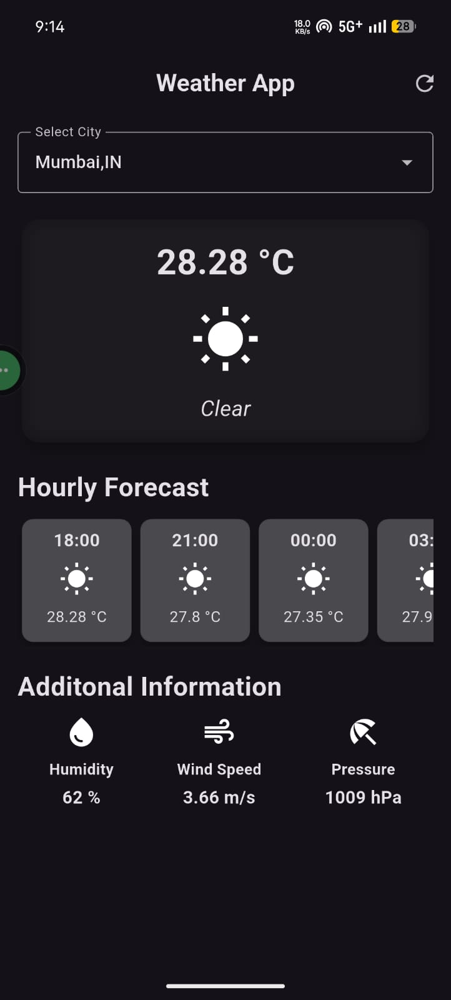
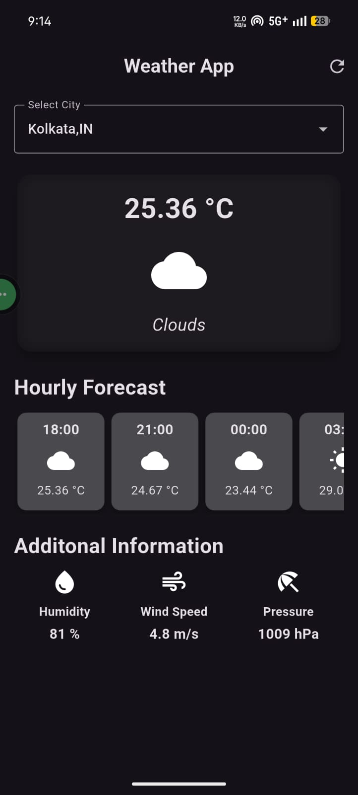

# Flutter Weather App

A simple weather application built using Flutter that fetches real-time weather data from an API.

## Features
- Search weather by city
- Displays temperature and weather condition
- Clean UI

## Technologies Used
- Flutter
- Dart
- REST API

## Getting Started
1. Clone the repository
2. Run `flutter pub get`
3. Add your API key
4. Run the app

## Screenshots
## Screenshots

